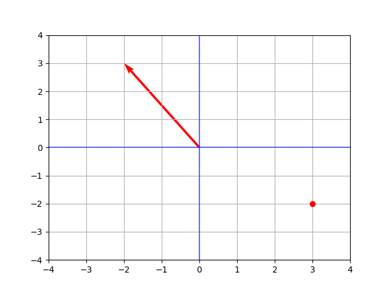
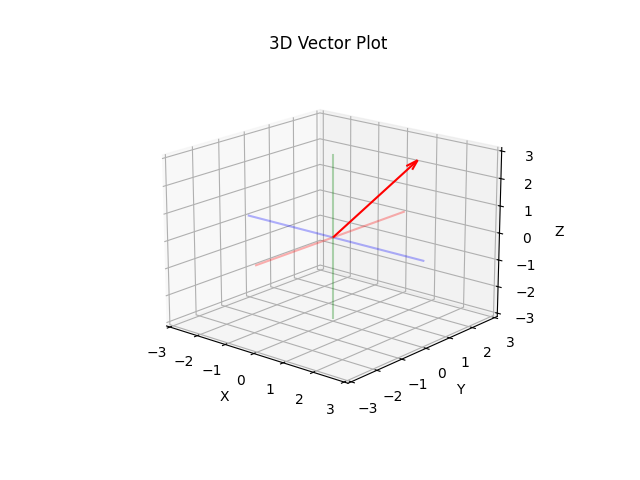

# Chapitre 1, Essence de l'algèbre linéaire

## Vecteurs :

### Qu'est ce qu'un vecteur ?
Trois perspectives sur les vecteurs, l'etudiant en physique, le mathématicien et l'étudiant en informatique.
* Pour l'étudiant en physique un vecteur est une fleche qui point dans un espace
    * il le définit par sa longueur et sa direction.
    * peut importe ou il se trouve dans l'espace, le vecteur reste le meme
    * un vecteur peut etre dans un espace en 2 dimension ou 3 dimensions
* Pour l'étudiant en informatique, les vecteurs sont des listes de nombres ordonnés
    * une liste de deux pour deux dimensions
* Pour un mathématicien, un vecteur peut etre n'importe quoi, ce qui compte c'est la façon dont ils sont additionné ou multiplié.
    * Additionner et multiplier un vecteur joue un role important en algebre linéaire.

### Sur un systeme de coordonnées

* En pensant à une fleche dans un systeme de coordonnée (un plan de coordonnée x et y) avec sa tete à l'origine (x=0, y=0), nous pouvons nous représenter facilement un vecteur.
    * ainsi représenté :

$$
\Bigl[
\begin{array}{cc}
   -2 \\
   3
\end{array}
\Bigr]
$$

* sera représenté sur un axe x et un axe y:

!!! warning

    Ne pas confondre un vecteur (représenté verticalement entre crochet) avec un point, présenté horizontalement entre parenthèse.  
    $(3, -2)$ sur le graphique ci dessus.

* En trois dimension un vecteur représenté :

$$
% \Big. \binom{2}{1}{3} \Big.
\Biggl[
\begin{array}{cc}
   2 \\
   1 \\
   3 
\end{array}
\Biggr]
$$

* Sera représenté avec un troisième axe, z :

### Addition de vecteurs
### Multiplication de vecteurs
### Conclusion
...

* [source](https://www.youtube.com/watch?v=fNk_zzaMoSs)

---

# Chapitre 2, Essence de l'algèbre linéaire

---

* [video essence of linear algebra de Grant Sanderson](https://www.youtube.com/playlist?list=PLZHQObOWTQDPD3MizzM2xVFitgF8hE_ab)
