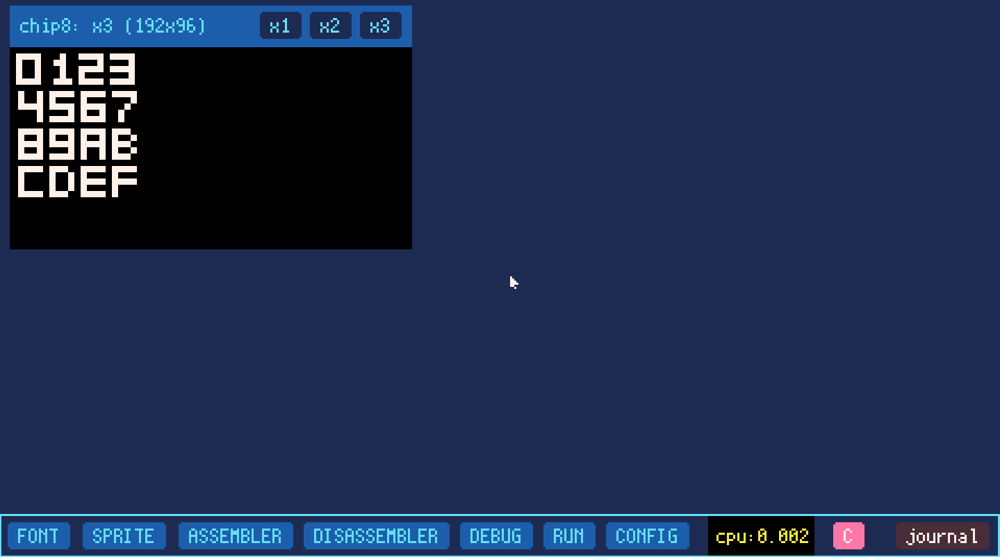
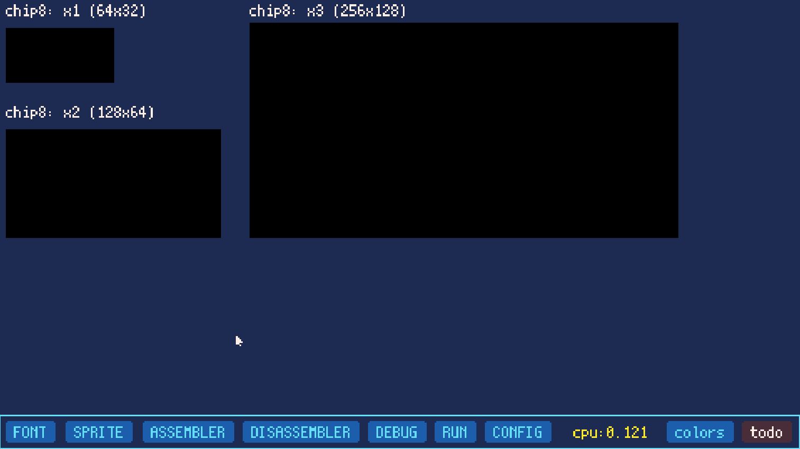
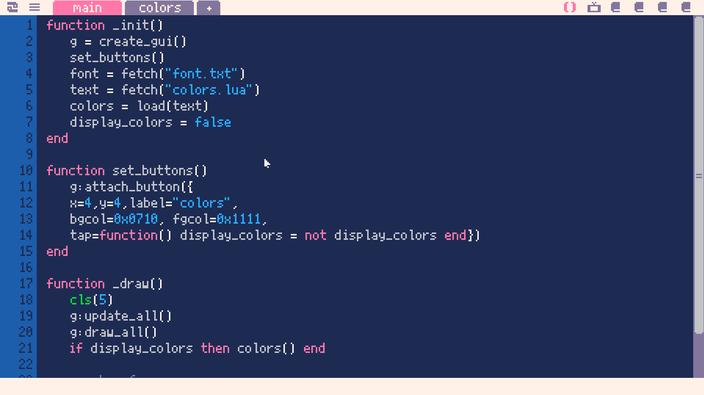
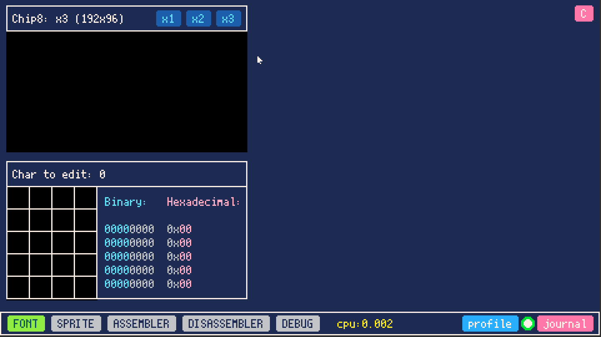

# Chip8 dev log

## 20 January: 

The font set is displayed in 3 zoom levels. Will look to select a single char to edit it now.

## 18 January

Worked on the sdk nav bar and a todo panel.

## 17 January

Let's start a year with #picotron dev, here a simple color widget called from an other program.

## 18 January

Last prototype, end playing with picotron.

